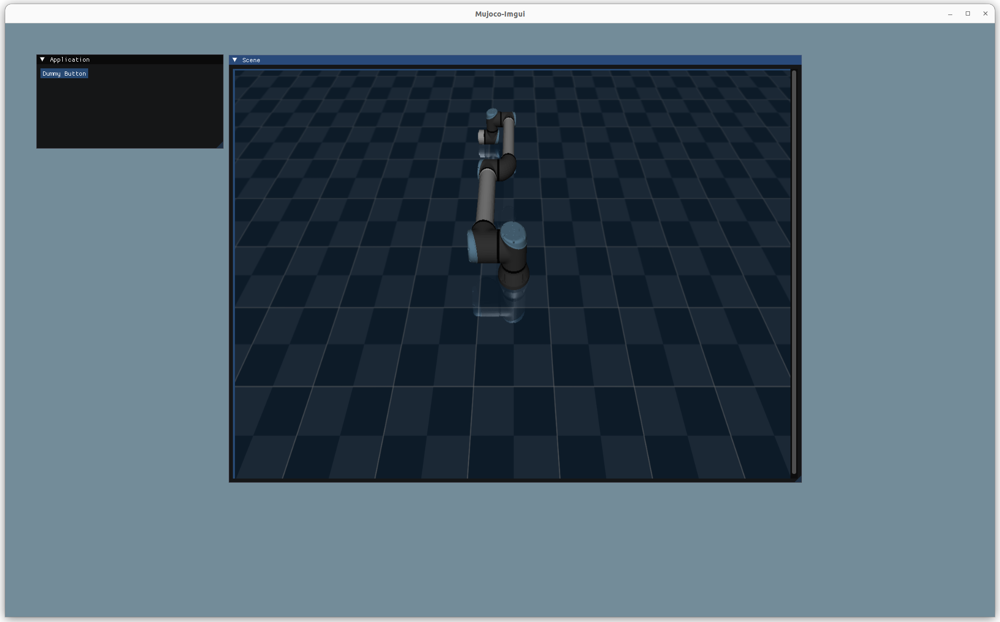

# mujoco_imgui




## Installation
1. Install OpenGL
```
sudo apt-get install libglfw3
sudo apt-get install libglfw3-dev
```
2. Build the project

Use `build.sh` script to build the project on a Linux machine. By default, it looks for `mujoco` in `$HOME"/build/mujoco-3.1.3/"`. If you installed mujoco in a different folder, please update `DIR_MUJOCO` in the build script. 
```
./build.sh
```
3. Once built, use `./run.sh` to open the program.   

## GUI

While hovering the scene, use left mouse button to rotate the view, right button to pan, and middle of mouse to scroll. 
